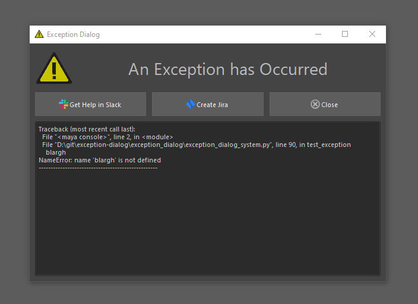

# exception-dialog
Simple dialog that shows exceptions when they occur.

# Install

<pre>
1. Download this package and unzip it in a good location 
    1.B (or git clone it directly if you have git installed)
2. Run installer.bat (will walk you through some options for install)
3. Restart the DCC
</pre>

# Start the tool
The exception dialog will register itself to the _sys.excepthook_ of the python interpreter.

The recommended approach is to trigger this function here during startup.
<pre>
import exception_dialog
exception_dialog.startup()
</pre>

# Extending the tool

During startup, the tool will search through the sys.path for any .py file starting with _"exception_dialog_ext"_

If it finds a file matching that pattern, it will import it.

So, for example, if there's a file called _exception_dialog_ext_slack_actions.py_ in any sys.path folder. It will be imported. 

Here's what such a file might look like:
<pre>
import exception_dialog.exception_dialog_system as eds

class SlackExceptionAction(eds.BaseExceptionAction):
    label = "Get Help in Slack"
    icon_name = "slack_icon"
    show_button = True  # show a button for this action in the dialog
    is_automatic = False  # should this action trigger automatically during an exception
    
    @staticmethod
    def trigger_action(exc_trace, exc_value, exc_typ):
        print("Trigger something in slack")
</pre>

Subclasses of BaseExceptionAction are automatically added to the dialog if <code>show_button</code> is set to True.

They can also be triggered from the exception by setting <code>is_automatic</code> to True.
